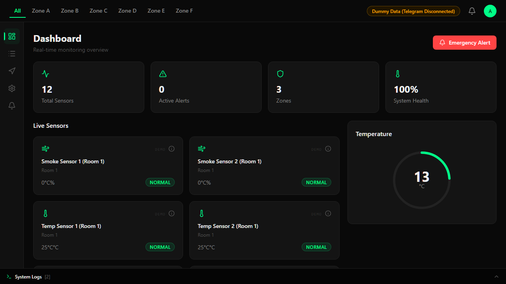
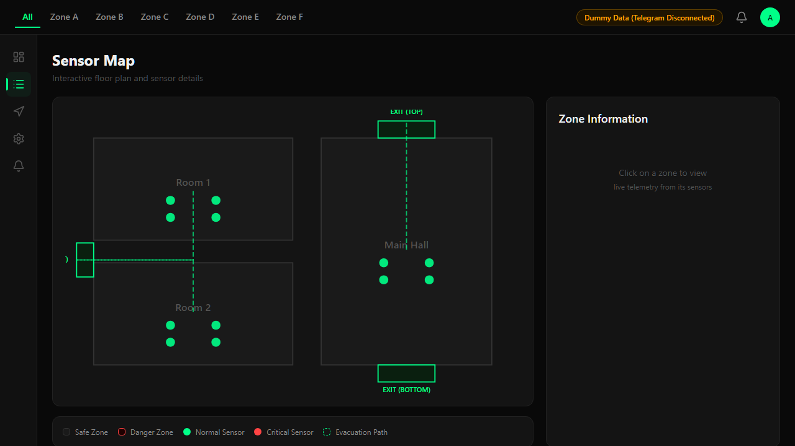
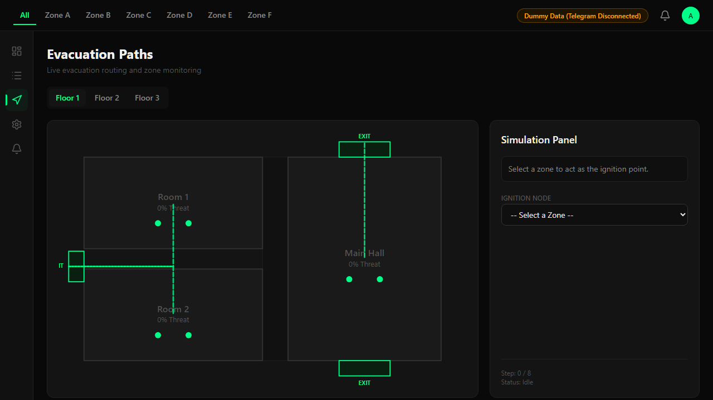

# Smart Fire Evacuation System 🔥🏃‍♂️

A premium, real-time dashboard and control center for intelligent fire detection and dynamic evacuation routing. Built with React and Vite, featuring a sleek dark-mode UI, dynamic SVGs, and Telegram bot integration.

[](https://reactjs.org/)
[](https://vitejs.dev/)
[](https://tailwindcss.com/)

---

## 🌟 Key Features

### 1. Real-Time Dashboard
A high-level overview of the entire facility.
- **KPI Metrics:** Total sensors, active alerts, monitored zones, and system health.
- **Live Sensor Feed:** Monitor temperature, smoke levels, and air quality across all rooms.
- **Dynamic Gauges:** Visual temperature tracking with real-time updates.



### 2. Interactive Sensor Map
A granular look at the building's infrastructure.
- **Filterable Data:** Filter sensors by zone (e.g., Room 1, Main Hall) or status (Normal, Warning, Danger).
- **History Logs:** Click "View History" on any sensor to open a slide-over panel featuring a historical reading chart (powered by Recharts).
- **Offline/Demo Mode:** Seamlessly falls back to simulated data with subtle "DEMO" UI indicators when a backend is not connected.



### 3. Dynamic Evacuation Routing
An intelligent floor plan that automatically routes occupants away from hazards.
- **Hazard Detection:** Map nodes turn red and recalculate exit routes automatically when smoke/gas thresholds are breached.
- **Fire Spread Simulator:** A built-in stress test that simulates a fire starting in an ignition node and spreading over an 8-step timeline.
- **Speed Controls:** Watch the simulation unfold at 1x, 2x, or 5x speed, with full pause/resume capabilities.



### 4. Control Panel & Overrides
Full administrative control over the facility.
- **Global Toggles:** Activate sprinklers, sound alarms, or lock down doors.
- **Zone Overrides:** Manually override a zone's status ("Mark Danger") which instantly syncs with the Evacuation Map to reroute occupants in real-time.
- **Sensor Thresholds:** Adjust safety thresholds for Smoke and Temperature warnings.

### 5. Telegram Integration & Alerts
Stay informed no matter where you are.
- **Alert Triage:** Filter alerts by Active/Resolved or severity (Critical vs Warning).
- **Optimistic Acknowledgement:** Acknowledge alerts instantly to log their resolution timestamps.
- **Telegram Broadcasting:** Connect a Telegram Bot to automatically broadcast critical emergency alerts directly to a mobile device.

---

## 🛠️ Technology Stack

- **Framework:** React 18 (Vite)
- **Styling:** Tailwind CSS (Dark theme architecture)
- **Icons:** Lucide React
- **Charts:** Recharts
- **Routing:** React Router DOM

---

## 🚀 Getting Started

### Prerequisites
- Node.js (v16+ recommended)
- npm or yarn

### Installation

1. **Clone the repository:**
   ```bash
   git clone https://github.com/yourusername/smart-fire-evac.git
   cd smart-fire-evac
   ```

2. **Install dependencies:**
   ```bash
   npm install
   ```

3. **Configure Environment Variables:**
   Create a `.env` file in the root directory and add the following:
   ```env
   # Set to true to connect to real backend/hardware, false for Demo Mode
   VITE_USE_REAL_DATA=false
   
   # Telegram Bot configuration for broadcasting alerts
   VITE_TELEGRAM_BOT_TOKEN=your_bot_token_here
   VITE_TELEGRAM_CHAT_ID=your_chat_id_here
   ```

4. **Start the development server:**
   ```bash
   npm run dev
   ```

5. **Build for production:**
   ```bash
   npm run build
   ```

---

## 📱 Telegram Bot Setup (Optional)
To enable real mobile notifications:
1. Message `@BotFather` on Telegram to create a new bot.
2. Copy the HTTP API Token provided.
3. Message `@userinfobot` to get your Chat ID.
4. Add both to your `.env` file.
5. In the app's Control Panel, click **"Send Test Notification"** to verify the connection.

---


